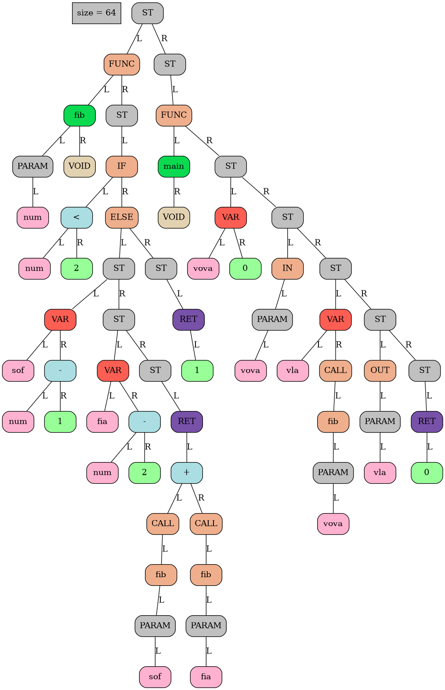
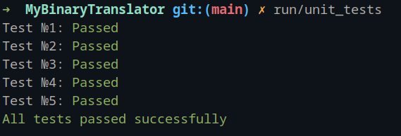

# JIT-компилятор
## Введение
Данный отчет представляет собой описание разработки JIT (Just-In-Time) компилятора для моего собственного [языка программирования](https://github.com/mr-gukas/MyLanguage).  Также в процессе разработки я работал с написанным мною [виртуальным процессором](https://github.com/mr-gukas/MyCPU), который представляет собой альтернативный способ исполнения программы. Целью моей работы было изучение JIT-компиляции, а также сравнение производительности между исполнением программы через JIT-компилятор и виртуальным процессором (далее встречаются как x86 и v86 соответственно).

Особенность JIT (Just-in-time) компилятора состоит в том, что результат трансляции - бинарный код, содержащий инструкции архитектуры, в которую происходит трансляция, исполняется сразу же после процесса трансляции (см. ниже). Для этого бинарный код сохраняется в массиве и вызывается в качестве функции.
## Процесс трансляция 
Объясним сначала понятие абстрактное синтаксическое дерево (AST):

AST (Abstract Syntax Tree) – это структура данных, представляющая синтаксическую структуру программы. После выполнения фронтенда моего языка программирования, программа преобразуется в AST. AST представляет собой дерево, где каждый узел соответствует определенному элементу программы (например, оператору, выражению или объявлению переменной), а дочерние узлы представляют его подэлементы. AST обычно используется в компиляторах для анализа и преобразования программы перед ее исполнением.



Примечание: Подробнее о структуре используемого мною AST можно прочитать в [данном репозитории](https://github.com/dodokek/LanguageStandart), в котором описывается коллегиально принятый группой из 18 человек вид дерева, которое будет считаться стандартом для всех. (Данное действие позволило нам поддерживать перевод из одного ЯП в другой).

В процессе трансляции происходит обход AST и преобразование его узлов с учетом контекста программы. Такое преобразование может включать оптимизации, проверки типов, генерацию промежуточного кода или генерацию кода на другом языке (например, компиляцию в машинный код).

В случае моего JIT компилятора, трансляция происходит за один проход по AST. Во время этого прохода, AST читается последовательно, дерево разбивается на анализ и трансляцию функций, которые в свою очередь делятся на трансляцию блоков связанных с циклами, операторами ветвления, инициализацией переменных, заполняется таблица имен, содержащая информацию о переменных, функциях и других элементах программы. Таблица имен позволяет JIT компилятору эффективно генерировать исполняемый код, учитывая контекст программы.

В изначальной версии проекта, был написан некий гибрид jit-транслятора и бинарного компилятора. В нашем мире такая технология не имеет практического применения, поэтому проект исправлен, а именно: сгенерированный бинарный код записывается не просто в буфер, а в исполняемый файл - ELF. 

## Трансляция инструкций
Рассмотрим как транслировались инструкции в v86 (виртуальный процессор) и в x86:
### Добавление чисел в стек (PUSH) 
#### PUSH IMM 
|   v86       | x86               | 
| ------      | :---------------: | 
| ``` PUSH IMM  ```     |  ``` mov rdi, IMM ``` <br> ``` push rdi ```  | 


#### PUSH REG 
|   v86       | x86               | 
| ------      | :---------------: | 
| ``` PUSH REG  ```     | <p style="text-align: left;"> ``` push r_x ```   </p>          |  


#### PUSH [IMM] 
|   v86       | x86               | 
| ------      | :---------------: | 
| ``` PUSH [IMM]  ```     | <p style="text-align: left;"> ``` mov rdi, qword IMM  ``` <br> ``` push rdi ```   </p>          |  

#### PUSH [REG] 
|   v86       | x86               | 
| ------      | :---------------: | 
| ``` PUSH [REG]  ```     | <p style="text-align: left;"> ``` mov rdi, qword [r_x]  ``` <br> ``` push rdi ```   </p>          |  


#### PUSH [IMM+REG] 
|   v86       | x86               | 
| ------      | :---------------: | 
| ``` PUSH [IMM+REG]  ```     | <p style="text-align: left;"> ``` mov rdi,  qword [r_x + IMM]  ``` <br> ``` push rdi ```   </p>          |  


### Перемещение чисел из стека (POP)
#### POP [IMM]
|   v86       | x86               | 
| ------      | :---------------: | 
| ``` POP [IMM]  ```     | <p style="text-align: left;"> ``` pop rdi ``` <br> ``` mov [IMM], rdi ```  </p>  |  


#### POP [REG] 
|   v86       | x86               | 
| ------      | :---------------: | 
| ``` POP [REG]  ```     | <p style="text-align: left;"> ``` pop rdi ``` <br> ``` mov [r_x], rdi ```  </p>  |  


#### POP REG 
|   v86       | x86               | 
| ------      | :---------------: | 
| ``` POP REG  ```     | <p style="text-align: left;"> ``` pop r_x ```   </p>          |  


#### POP [IMM+REG] 
|   v86       | x86               | 
| ------      | :---------------: | 
| ``` PUSH [IMM+REG]  ```     | <p style="text-align: left;"> ``` pop rdi ``` <br> ``` mov [r_x + IMM],  rdi ```   </p>          |  

### Математические операции
#### ADD
|   v86       | x86               | 
| ------      | :---------------: | 
| ``` ADD  ```     | <p style="text-align: left;"> ``` add rsi, rdi ```   </p>          |  

#### SUB 
|   v86       | x86               | 
| ------      | :---------------: | 
| ``` SUB  ```     | <p style="text-align: left;"> ``` sub rsi, rdi ```   </p>          |  

#### MUL 
|   v86       | x86               | 
| ------      | :---------------: | 
| ``` MUL  ```     |<p style="text-align: left;"> ``` mov r10, rax ``` <br> ``` mov rax, rsi ```  <br> ``` mul rdi ``` <br> ``` push rax ``` <br> ``` mov rax, r10 ``` </p> |  

#### DIV 
|   v86       | x86               | 
| ------      | :---------------: | 
| ``` DIV  ```     |<p style="text-align: left;"> ``` mov r10, rax ``` <br> ``` mov rax, rsi ```  <br> ``` push rdx ``` <br> ``` xorrdx, rdx ``` <br> ``` div rdi ``` <br> ``` pop rdx ``` <br> ``` push rax``` <br> ``` mov rax, r10 ``` </p> |  


####  SQRT
|   v86       | x86               | 
| ------      | :---------------: | 
| ``` SQRT  ```     |<p style="text-align: left;"> ``` movsd xmm0, qword [rsp] ``` <br> ``` sqrtpd xmm0, xmm0 ```  <br> ``` movsd qword [rsp], xmm0 ``` </p> |  

#### Оператор сравнения <
|   v86       | x86               | 
| ------      | :---------------: | 
| ``` ISBT  ```     |<p style="text-align: left;"> ``` cmp rdi, rsi ``` <br> ``` jl less ```  <br> ``` push 1 ``` <br> ``` jmp done ``` <br> ``` less: ``` <br> ``` push 0 ``` <br> ``` done: ``` </p> |  

*Примечание: Перед началом этих опрераций происходит перемещание значений операндов из стека в регистры rdi, rsi. Результат операции перемещается в стек.

### Переходы
#### JMP
|   v86       | x86      |  
| ------         | :---------------: | 
|``` JMP <32b rel. ptr.>  ```      |  ```jmp <32b rel. ptr.> ```      |

#### CALL 
|   v86       | x86      |  
| ------         | :---------------: | 
|``` CALL <32b rel. ptr.> ```       |  ```call <32b rel. ptr.>  ```     |

#### RET
|   v86       | x86      |  
| ------         | :---------------: | 
``` RET  ```      | ``` ret    ```   |

Условные переходы имеют такое же соответствие.

### Вывод значений

В v86 вывод значений осуществлялся командой ```OUT```, которая брала значение из стека и выводила его на экран при помощи функции ```printf``` стандартной библиотеки С.

В x86 вызывается функция для печати одного числа, используя тот же ```printf``` из стандартной библиотеки. Единственное отличие - стек должен быть выровнен, а данные храниться в определенных регистрах

Для вывода значений была реализована на ассемблере функция [_printf](https://github.com/mr-gukas/MyBinaryTranslator/blob/main/lib/stdlib/printf.asm), из этой программы был получен бинарный файл, который был скопирован в наш исполняемый файл.

### Ввод значений

В v86 ввод значений осуществлялся командой ```IN```, которая считывала введенное пользователем число при помощи функции ```scanf``` стандартной библиотеки С и клала это значение в стек.

В x86 ввод значения аналогичен тому, как был реализован вывод. (см. [функция считывания числа](https://github.com/mr-gukas/MyBinaryTranslator/blob/main/lib/stdlib/scanf.asm))

## Тестирование производительности
Для тестирования JIT написаны программы, которые вычисляют факториал числа n и n-ое число Фибоначчи. Исходники этих программ, написанных на моем языке программирования можно найти [здесь](https://github.com/mr-gukas/MyBinaryTranslator/tree/main/tests)

Прежде чем замерять время исполнения, проведем пару тестов, чтобы убедиться в правильности работы x86 и v86:



Убедившись в корректности выходных данных переходим, к замеру производительности. Он включает в себя вычисления факториала 5  и 5-го числа Фибоначчи в цикле 1000 раз. 


 | Программа | Время выполнения v86, мс | Время выполнения x86, мс | Коэффициент ускорения |
 |----------------| ---------  |----------------| --------- |
 | Факториал | 1453      | 121      | 12      |
 | Фибоначчи | 3823      | 141      | 27      |

 Заметен сильный прирост производтильности. Бинарный транслятор одерживает победу над виртуальным процессором.

 ### Выводы
 
 В ходе работы мы изучили и реализовали бинарный траснлятор, который показал значительное улучшение производительности (в среднем в 20 раз) по сравнению с виртуальным процессором. 

Данный опыт подтвердил значимость и преимущества бинарной трансляции в контексте разработки языков программирования и интерпретаторов. Она позволяет достичь более высокой производительности программы.

Дальнейшее исследование и разработка в области LLVM  позволит нам расширить возможности нашего языка программирования, обеспечить более высокую производительность и интеграцию с другими системами.


